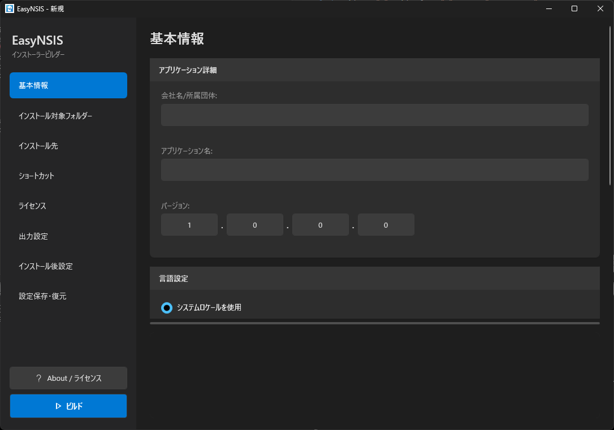

# EasyNSIS

NSIS (Nullsoft Scriptable Install System) を使用してWindowsインストーラーを簡単に作成するためのGUIアプリケーションです。


[English](README_en.md)

## 特徴

- **ビジュアルなインストーラー設定** - モダンなUIで直感的に設定
- **Windowsテーマ自動対応** - ライト/ダークテーマに自動追従
- **カード型レイアウト** - 背景色付きヘッダーで見やすいセクション分け
- **NSISスクリプト自動生成** - Unicode対応のNSISスクリプトを自動生成
- **複数のインストール先対応** - AppData、Program Files、カスタムパスに対応
- **ショートカット管理** - デスクトップ・スタートメニューのショートカット作成（適切なアイコン自動設定）
- **ライセンス設定** - デフォルト、外部ファイル、直接入力に対応
- **多言語対応** - 日本語・英語UI
- **設定の保存・読み込み** - XML形式で設定を保存・復元

## スクリーンショット



## 動作要件

- Windows 10/11 (x64)
- .NET 10.0 Runtime（自己完結型ビルドに含まれています）
- NSIS 3.11（配布物に含まれています）

## インストール方法

1. [Releases](../../releases)から最新版をダウンロード
2. 任意のフォルダーに展開
3. `EasyNSIS.exe` を実行

## ソースからのビルド

### 必要なもの

- .NET 10.0 SDK
- Visual Studio 2022 または VS Code（C#拡張機能付き）
- NSIS 3.11

### NSIS のセットアップ

EasyNSISを動作させるには、NSIS 3.11を以下の手順でセットアップしてください。

1. NSISをダウンロード:
   ```
   https://downloads.sourceforge.net/project/nsis/NSIS%203/3.11/nsis-3.11.zip
   ```

2. ダウンロードしたzipファイルを展開

3. 展開したフォルダーを以下のディレクトリ構造になるように配置:
   ```
   EasyNSIS/
   └── Tools/
       └── nsis-3.11/
           ├── makensis.exe    ← このファイルが必要
           ├── Contrib/
           ├── Include/
           ├── Plugins/
           └── ...
   ```

**重要**: `Tools/nsis-3.11/makensis.exe` が存在しない場合、アプリケーションは起動時にエラーを表示します。

### ビルド手順

```bash
# リポジトリをクローン
git clone https://github.com/yourusername/EasyNSIS.git
cd EasyNSIS

# 依存関係を復元
dotnet restore

# ビルド
dotnet build

# 実行
dotnet run
```

### 発行

```bash
# 自己完結型実行ファイルを作成
dotnet publish -c Release
```

## 使い方

### 基本的なワークフロー

1. **基本情報** - 会社名、アプリケーション名、バージョンを入力
2. **インストール対象** - インストールするファイルが含まれるフォルダーを選択
3. **インストール先** - アプリケーションのインストール先を選択
4. **ショートカット** - デスクトップ・スタートメニューのショートカットを設定
5. **ライセンス** - ライセンスの種類と内容を設定
6. **出力設定** - インストーラーの出力先フォルダーを選択
7. **ビルド** - 「Build」ボタンをクリックしてインストーラーを生成

---

## 各タブの詳細説明

### 1. 基本情報 (Basic Info)

インストーラーの基本的な情報を設定します。

| 項目 | 説明 | 必須 |
|------|------|:----:|
| **会社名/所属団体** | インストーラーに表示される会社名。「アプリと機能」にも表示されます。64文字以内。 | ○ |
| **アプリケーション名** | インストールするアプリケーションの名前。インストール先フォルダー名にも使用されます。64文字以内。 | ○ |
| **バージョン** | アプリケーションのバージョン番号。Major.Minor.Build.Revision形式（例: 1.0.0.0）。各セグメントは0-65535の範囲。 | ○ |

#### 言語設定

| オプション | 説明 |
|------------|------|
| **システムロケールを使用** | インストーラーの言語をユーザーのシステム設定に合わせます（推奨） |
| **固定言語** | インストーラーの言語を日本語(ja-JP)または英語(en-US)に固定します |

#### 登録モード

| オプション | 説明 |
|------------|------|
| **アプリと機能に登録する** | Windowsの「アプリと機能」（プログラムの追加と削除）に登録します。これにより、ユーザーは標準的な方法でアンインストールできます。（デフォルト） |
| **レジストリを使用しない** | レジストリへの書き込みを行いません。ポータブルアプリケーション向け。このオプションを選択すると「アプリと機能」への登録も行われません。 |

#### インストーラーアイコン

インストーラー実行ファイル(.exe)のアイコンを設定します。.ico形式のファイルを指定してください。未指定の場合はNSISのデフォルトアイコンが使用されます。

---

### 2. インストール対象フォルダー (Source Folder)

インストールするファイルが含まれるフォルダーを指定します。

| 項目 | 説明 |
|------|------|
| **ソースフォルダーパス** | インストール対象のファイル・フォルダーが含まれるディレクトリのパス |

**注意事項:**
- 指定したフォルダー内のすべてのファイルとサブフォルダーがインストール対象になります
- フォルダー構造はそのまま維持されます
- 空のフォルダーは含まれません
- 隠しファイル・システムファイルも含まれます

**予約ファイル名:**
以下のファイル名はEasyNSISが内部で使用するため、ソースフォルダーに含めることはできません：
- `installed_files.dat` - インストールファイル一覧
- `installed_version.dat` - インストール済みバージョン情報
- `Uninstall.exe` - アンインストーラー

---

### 3. インストール先 (Install Destination)

アプリケーションのインストール先を設定します。

#### 既定のインストール先

| オプション | パス例 | 管理者権限 |
|------------|--------|:----------:|
| **AppData (Roaming)** | `C:\Users\<user>\AppData\Roaming\<Company>\<App>` | 不要 |
| **AppData (Local)** | `C:\Users\<user>\AppData\Local\<Company>\<App>` | 不要 |
| **Program Files** | `C:\Program Files\<Company>\<App>` | **必要** |
| **カスタム** | 任意のパス | 場所による |

**推奨:**
- ユーザー単位のアプリケーション → **AppData (Roaming)** または **AppData (Local)**
- システム全体へのインストール → **Program Files**
- ポータブルアプリケーション → **カスタム**

#### ユーザーによるインストール先変更の許可

チェックを入れると、インストール時にユーザーがインストール先を変更できるようになります。

#### アンインストール時のクリーンアップ

| オプション | 説明 |
|------------|------|
| **すべて削除** | インストール先フォルダー内のすべてのファイル・フォルダーを削除します |
| **ユーザーデータ保護** | インストール時に配置したファイルのみ削除し、ユーザーが作成したファイル（設定ファイル、ログなど）は保持します |

#### ファイル管理の仕組み

「ユーザーデータ保護」モードでは、EasyNSISはインストール時に配置したファイルを追跡し、アンインストール時やアップグレード時に正確に管理します。

**インストール時に生成されるファイル:**

| ファイル | 説明 |
|----------|------|
| `installed_files.dat` | インストールされたすべてのファイルとディレクトリの一覧。`FILE:相対パス` または `DIR:相対パス` 形式で記録されます。 |
| `installed_version.dat` | インストールされたアプリケーションのバージョン番号が記録されます。 |

**動作:**

1. **新規インストール時**: ソースフォルダーの内容がインストール先にコピーされ、`installed_files.dat`と`installed_version.dat`が生成されます。

2. **アップグレード時**:
   - 既存の`installed_files.dat`を読み込み、前バージョンでインストールされたファイルを特定
   - 新バージョンに含まれないファイルを削除（ユーザーが作成したファイルは保持）
   - 新しいファイルをインストールし、`installed_files.dat`を更新

3. **アンインストール時**:
   - `installed_files.dat`に記録されたファイルのみを削除
   - ユーザーが作成したファイル（設定ファイル、ログなど）は保持
   - 空になったディレクトリは削除

**注意:** これらの管理ファイルはインストール先フォルダーのルートに配置され、アンインストール時に自動的に削除されます。

---

### 4. ショートカット (Shortcuts)

デスクトップとスタートメニューに作成するショートカットを設定します。

#### デスクトップショートカット

ユーザーのデスクトップに作成するショートカットを指定します。

| ボタン | 説明 |
|--------|------|
| **+ File** | 実行ファイル(.exe)へのショートカットを追加 |
| **+ Folder** | フォルダーへのショートカットを追加 |
| **- Remove** | 選択したショートカットを削除 |

#### スタートメニューショートカット

Windowsスタートメニューに作成するショートカットを指定します。スタートメニューには「会社名」フォルダーが作成され、その中にショートカットが配置されます（会社名が未入力の場合はアプリケーション名が使用されます）。

#### ショートカットアイコン

| 種類 | アイコン |
|------|----------|
| **ファイル** | ターゲットファイル自体のアイコンを使用 |
| **フォルダー** | Windowsの標準フォルダーアイコン（shell32.dll）を使用 |

**ヒント:**
- メインの実行ファイルは必ずショートカットに追加することを推奨します
- ドキュメントフォルダーやReadmeファイルへのショートカットも追加できます

---

### 5. ライセンス (License)

インストール時に表示するライセンス契約を設定します。

| オプション | 説明 |
|------------|------|
| **デフォルトのライセンス** | EasyNSISに含まれるデフォルトのライセンステキストを使用します（言語設定に応じて日本語/英語） |
| **外部ファイル指定** | 独自のライセンスファイル(.txt)を指定します |
| **テキスト直接入力** | ライセンステキストを直接入力します |

**対応フォーマット:**
- プレーンテキスト (.txt)

**文字コード自動判別:**
- 外部ファイルの文字コードはUTF.Unknownライブラリで自動判別されます
- UTF-8、Shift_JIS、EUC-JP等の主要なエンコーディングに対応
- NSISのライセンス表示用にシステムのコードページ（日本語環境ではCP932）に自動変換

---

### 6. 出力設定 (Output)

生成されるインストーラーの出力先とアンインストール時の動作を設定します。

| 項目 | 説明 |
|------|------|
| **出力フォルダー** | インストーラー(.exe)が出力されるフォルダー |

#### アンインストール時のクリーンアップ

| オプション | 説明 |
|------------|------|
| **すべて削除** | インストール先フォルダー内のすべてのファイル・フォルダーを削除します |
| **ユーザーデータ保護** | インストール時に配置したファイルのみ削除し、ユーザーが作成したファイル（設定ファイル、ログなど）は保持します（デフォルト） |

#### 出力されるファイル

ビルド実行時、以下のファイルが出力フォルダーに生成されます：

| ファイル | 説明 |
|----------|------|
| `<アプリケーション名>_<バージョン>_Setup.exe` | 生成されたインストーラー実行ファイル |
| `<アプリケーション名>_Setup.nsi` | NSISスクリプトファイル（デバッグ・カスタマイズ用） |
| `<アプリケーション名>_License.txt` | ライセンステキストファイル（システムコードページでエンコード） |

**例:** アプリケーション名が「MyApp」、バージョンが「1.0.0.0」の場合
- `MyApp_1.0.0.0_Setup.exe`
- `MyApp_Setup.nsi`
- `MyApp_License.txt`

---

### 7. インストール後設定 (Post-Install)

インストール完了後に実行するアクションを設定します。

| 項目 | 説明 |
|------|------|
| **インストールフォルダーを開く** | インストール完了後にエクスプローラーでインストール先フォルダーを自動的に開きます |
| **ファイルを実行する** | インストール完了後に指定したファイルを自動実行します |

#### ファイル実行設定

「ファイルを実行する」を有効にした場合、以下を設定します：

| 項目 | 説明 |
|------|------|
| **実行するファイル** | インストール対象フォルダーからの相対パスで指定します。実行ファイル(.exe)またはバッチファイル(.bat, .cmd)を指定できます。 |

**活用例:**
- メインアプリケーションの自動起動
- 初期設定ウィザードの実行
- セットアップ完了メッセージの表示

---

### 8. 設定保存・復元 (Save/Load)

現在の設定をXMLファイルとして保存・読み込みできます。

| ボタン | 説明 |
|--------|------|
| **読み込み** | 保存済みの設定ファイル(.xml)を読み込みます |
| **保存** | 現在の設定を既存のファイルに上書き保存します |
| **名前を付けて保存** | 現在の設定を新しいファイルとして保存します |

**活用例:**
- プロジェクトごとに設定ファイルを保存
- チーム間で設定を共有
- CI/CDパイプラインでの自動ビルド

---

## ビルド実行

すべての設定が完了したら、サイドバー下部の「**Build**」ボタンをクリックしてインストーラーを生成します。

### ビルド中の表示

- ログエリアにNSISコンパイラの出力がリアルタイムで表示されます
- スピナーアニメーションで処理中であることを示します
- 「**中断**」ボタンでビルドをキャンセルできます

### ビルド完了

ビルドが完了すると、結果ダイアログが表示されます。

- **成功時**: 「フォルダーを開く」ボタンで出力先を開けます
- **失敗時**: ログを確認してエラーの原因を特定してください

---

## 設定ファイル形式

設定はXML形式で保存されます。

```xml
<?xml version="1.0" encoding="utf-8"?>
<EasyNsisConfig version="1">
  <BasicInfo>
    <CompanyName>会社名</CompanyName>
    <ApplicationName>アプリ名</ApplicationName>
    <Version>1.0.0.0</Version>
    <Language type="locale" value="ja-JP"/>
    <RegistrationMode>RegisterToAppsAndFeatures</RegistrationMode>
    <InstallerIcon>path/to/icon.ico</InstallerIcon>
  </BasicInfo>
  <SourceFolder>
    <Path>C:\source\folder</Path>
  </SourceFolder>
  <InstallDestination>
    <Type>AppDataRoaming</Type>
    <CustomPath></CustomPath>
    <AllowUserChange>true</AllowUserChange>
  </InstallDestination>
  <Shortcuts>
    <Desktop>
      <Item type="file">app.exe</Item>
    </Desktop>
    <StartMenu>
      <Item type="file">app.exe</Item>
    </StartMenu>
  </Shortcuts>
  <License>
    <Type>text</Type>
    <FilePath></FilePath>
    <Text></Text>
  </License>
  <Uninstall>
    <Cleanup>PreserveUserData</Cleanup>
  </Uninstall>
  <Output>
    <Folder>C:\output\folder</Folder>
  </Output>
  <PostInstall>
    <OpenInstallFolder>false</OpenInstallFolder>
    <RunAfterInstall>false</RunAfterInstall>
    <RunAfterInstallPath></RunAfterInstallPath>
  </PostInstall>
</EasyNsisConfig>
```

---

## プロジェクト構成

```
EasyNSIS/
├── Assets/           # アプリアイコン、デフォルトライセンス
├── Licenses/         # サードパーティライセンスファイル（埋め込み）
├── Tools/nsis-3.11/  # NSISコンパイラ
├── Models/           # データモデル
├── ViewModels/       # MVVM ViewModel
├── Views/            # ダイアログウィンドウ
├── Services/         # ビジネスロジック
├── Helpers/          # 値コンバーター、テーマヘルパー
├── Resources/        # ローカライズリソース
├── tests/            # ユニットテスト
│   └── EasyNSIS.Tests/
└── EasyNSIS.csproj
```

## テスト

ユニットテストはxUnitフレームワークを使用して実装されています。

```bash
# テスト実行
dotnet test tests/EasyNSIS.Tests
```

詳細は [test/UnitTest.md](test/UnitTest.md) を参照してください。

## 技術スタック

- **.NET 10.0** + **WPF** - Windowsデスクトップアプリケーションフレームワーク
- **Fluent Design** - モダンなWindows UIテーマ（Windowsテーマ自動対応）
- **CommunityToolkit.Mvvm** - MVVMパターン実装
- **Microsoft.Extensions.DependencyInjection** - 依存性注入
- **UTF.Unknown** - 文字コード自動判別ライブラリ
- **NSIS 3.11** - インストーラースクリプトコンパイラ

### Windowsテーマ対応

EasyNSISはWindowsのテーマ設定（ライト/ダーク）を自動検出し、UIの配色を自動的に切り替えます。

- Windowsの「設定」→「個人用設定」→「色」でテーマを変更すると、リアルタイムでUIが更新されます
- すべてのカード、ログエリア、ボタン、ダイアログがテーマに対応
- コンテンツエリアとログエリアの間のスプリッターも視認性を考慮した色で表示

## サードパーティライセンス

このアプリケーションは以下のオープンソースライブラリを使用しています：

| ライブラリ | ライセンス |
|-----------|-----------|
| [CommunityToolkit.Mvvm](https://github.com/CommunityToolkit/dotnet) | MIT |
| [Microsoft.Extensions.DependencyInjection](https://github.com/dotnet/runtime) | MIT |
| [Microsoft.Xaml.Behaviors.Wpf](https://github.com/microsoft/XamlBehaviorsWpf) | MIT |
| [UTF.Unknown](https://github.com/CharsetDetector/UTF-unknown) | MIT / MPL 1.1 / LGPL |
| [NSIS](https://nsis.sourceforge.io/) | zlib/libpng |

詳細はアプリケーション内の「**About / Licenses**」ダイアログをご覧ください。

## コントリビューション

コントリビューションは大歓迎です！Pull Requestをお気軽にお送りください。

1. リポジトリをフォーク
2. フィーチャーブランチを作成 (`git checkout -b feature/AmazingFeature`)
3. 変更をコミット (`git commit -m 'Add some AmazingFeature'`)
4. ブランチにプッシュ (`git push origin feature/AmazingFeature`)
5. Pull Requestを作成

## ライセンス

このプロジェクトはMITライセンスの下で公開されています。詳細は[LICENSE](LICENSE)ファイルをご覧ください。

## 謝辞

- [NSIS](https://nsis.sourceforge.io/) - Nullsoft Scriptable Install System
- [.NET Foundation](https://dotnetfoundation.org/) - .NETランタイムとライブラリ
- [Microsoft](https://github.com/microsoft) - WPFとFluent Design

## 作者

Your Name / Your Company

---

Made with [Claude Code](https://claude.ai/claude-code)
